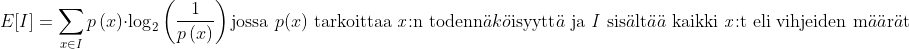
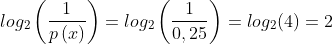

# sanulimoguli
[Sanuli](https://sanuli.fi) ([github](https://github.com/Cadiac/sanuli)) on suomenkielinen versio suositusta Wordle-pelistä. Sanulimoguli laskee  kaikkien sanojen kelpoisuuden aloitussanaksi. Ohjelma laskee kelpoisuuden olettaen, ettei edellisiä arvauksia ole tehty. Periaatteessa poistamalla kaikki ei-mahdolliset sanat arvausten perusteella sanaluettelosta sen saisi pelaamaan Sanulia itsestään.

### Yhteenveto sanoista:

**5 parasta aloitussanaa:**
1. KASTI: 6.13
2. KILTA: 6.07
3. KILSA: 6.04
4. KARSI: 6.04
5. SILTA: 6.02

**5 huonointa aloitussanaa:**
1. MÖMMÖ: 1.36
2. JÄÄDÄ: 1.71
3. LÖLLÖ: 1.75
4. NYNNY: 1.88
5. KÖKKÖ: 1.95

Suurempi arvo nostaa sanan kelpoisuutta.
## Käyttö
Koko ohjelman voi suorittaa komennolla ``py sanuli.py``. Ohjelma aluksi laskee ja tallentaa sanojen kelpoisuudet aloitussanoiksi, jonka jälkeen tekee yhteenvedon parhaimmista ja huonoimmista aloitussanoista. Ohjelmalla voi myös hakea tietyn sanan kelpoisuutta.
Kaikki mahdolliset sanat löytyy tiedostosta ``words-parsed.txt`` -tiedostosta. Sanat on kaivettu suoraan Sanulin WASM-tiedostosta. Lasketut entropiat jokaiselle sanalle aloituksessa löytyy JSON-muodossa tiedostosta ``entropies.txt``.
## Kiitokset
Koko projekti sai inspiraation 3Blue1Brownin erinomaisesta videosta [Solving Wordle using information theory](https://youtu.be/v68zYyaEmEA). Kannattaakin katsoa se viimeistään ennen sukeltamista teoriaan ja matematiikkaan.
## Ongelmat
Aloitussanat ovat parhaita *teoriassa* ja ne valitaan todennäköisyyksien perusteella. Suuri ero koneen ja ihmisen pelaamiseen on esimerkiksi se, että aloituksessa (ainakin itse) koitan saada mahdollisimman monta vokaalia alussa selvitettyä, koska on helpompi hahmottaa sanoja joissa vokaalit (toisin kuin konsonantit) ovat tietyillä paikoilla. Tietokone ei tarvitse hahmottamista työkalukseen, koska se muistaa aina kaikki mahdolliset sanat.

Huomioitakoon, ettei Sanulimoguli myöskään ota huomioon sanayhdistelmiä aloituksessa, kuten omaa vakiotani OMENA-PURSI.
## Entropia ja muu *matematiikka :(((((*
Matematiikassa entropialla voidaan mitata joukon "tasaisuutta", eli toisin sanoen vaihtelun määrää. Sanulissa entropian voi käytännössä ajatella ennusteena information määrästä, jonka arvattu sana antaa. Mitä vähemmän vaihtelua "vihjeiden" (selitetty piakkoin) määrissä, sitä parempi sana on. Hämmentävää.
**Entropian laskeminen:**
  
Kaava voi aluksi tosiaan vaikuttaa hieman hämmentävältä (miten logaritmi liittyy Sanuliin?), mutta se on hyvin toimiva pienen tutkiskelun jälkeen. x:llä tarkoitetaan Sanulin tapauksessa sanan kaikkien mahdollisten "vihjeiden" määriä. Esimerkiksi jos YÖPUU olisi oikea sana, arvauksella MÖMMÖ saisi vihjeen *HARMAA-VIHREÄ-HARMAA-HARMAA-HARMAA* (tästedes 0=harmaa, 1=keltainen ja 2=vihreä). Ohjelma laskee kaikille sanoille kaikki mahdolliset vihjeet ja niiden määrät suhteessa toisiinsa. Esimerkiksi MÖMMÖllä yleisin vihje jonka alussa voi saada, on *0-0-0-0-0*, jonka todennäköisyys on noin 80%. Toiseksi yleisin vihje on *2-0-0-0-0*, jonka todennäköisyys on vain surkeat 6%.

MÖMMÖ sattuu olemaan huonoin mahdollinen aloitusarvaus. Paremmissa arvauksissa vihjeiden todennäköisyyksien välinen vaihtelu onkin paljon lievempää. Esimerkiksi sanalla KOIRA (erinomainen aloitussana, sijalla 33) yleisin vihje on vieläkin *0-0-0-0-0*, mutta sen todennäköisyys on enää noin 8%. Toisella sijalla tulee *0-1-0-0-0*, jonka todennäköisyys on lähes sama, hieman vajaa 7%.

Tässä täytyy vielä huomauttaa, ettei hyvissä arvauksissa *0-0-0-0-0* ole huono vihje. Se kertoo jo aika paljon oikeasta sanasta, sillä sanassa ei ole mitään arvauksen kirjaimista. Parhaalla mahdollisella arvauksella KASTI, sanoja, joissa ei ole mitään arvauksen kirjaimista on vain noin 8% kaikista sanoista.

*Mut nipa, mikä hemmetin logaritmi? Ja miks **kahen** kannalla?*
Logaritmin avulla Sanuliin liittyviä todennäköisyyksiä on paljon luonnollisempi käsitellä. Kun arvauksesta saatu informaatio/entropia nousee yhdellä (huomaa, että kaikilla sanoilla on oma aloitusvakio), jäljellä olevien arvausten määrä puolittuu. Tästä juuri kahden kanta tulee (kymmenen kantaa käyttäessä arvausten määrä jaettaisiin aina kymmenellä *informaation* noustessa yhdellä). Siispä jos jokin vihje leikkaisi kaikki mahdolliset arvaukset 25%:iin, logaritmilla arvo olisi
  
sillä mahdollisten ratkaisujen määrä on *puolittunut* kaksi kertaa. Kutsutaan siis tästedes tätä logaritmin kautta laskettua todennäköisyyttä *informaatioksi*.

Mitä suurempi saatu informaatio arvauksella on, sitä parempi, sillä mahdollisten jäljellä olevien sanojen määrä on pienempi. Jokaisella vihjeellä on siis oma informaatiomäärä. Esimerkiksi, jos kävisi niin hyvä tuuri että MÖMMÖä käyttäen vihjeeksi tulisi *0-2-0-0-0*, jäljelle jäisi enää vain 56 mahdollista sanaa. MÖMMÖ olisi siten leikannut mahdollisten sanojen määrän 3327:stä (kaikkien sanojen määrä) 56:een, eli jäljellä olisi enää vain 1,7% alkuperäisistä sanoista. Saatu informaatio täten olisi noin 5,9, joka tarkoittaa että sanojen määrä on puolittunut noin 6 kertaa.

**Entropian laskeminen (uudestaan):**
  
Entropia siis tarkoittaa kaikkien mahdollisten vihjeiden informaation keskiarvoa, eli ennustetta siitä kuinka paljon informaatiota arvauksesta saadaan. Näinpä paras mahdollinen sana on se, jonka entropia on suurin. MÖMMÖn entropia on vain 1,36. Informaatiota ei siis yleensä kery paljoa. Useimmiten vihjeeksi tulee *0-0-0-0-0*, noin 80% kaikista peleistä. Kyseisestä vihjeestä saatu informaatio on hyvin pieni, sillä se karsii vain 659 sanaa 3327:stä. Vihjeestä saatu informaatio on vielä ennustettakin (entropiaa) pienempi, kävi siis huono tuuri. MÖMMÖn entropiaa kuitenkin nostaa kaikki muut mahdolliset vihjeet. Jos vihjeeksi tulisi oikeastaan mikä tahansa muu kuin rivi tyhjää, se jättäisi mahdollisten sanojen määrän enää marginaalisen pieneksi. MÖMMÖ on siis hardcore-avaaja, mutta samalla myös *high-risk, high-reward* -taktiikka. Kaikista parhaimmat sanat ovat niitä, jotka luovat vakaimman jakauman vihjeiden todennäköisyyksien välillä, mikä on juuri sitä mitä entropia laskee.
[wikipedia-linkki entropiaan](https://en.wikipedia.org/wiki/Entropy_(information_theory))

**TLDR: Mitä suurempi entropia sanalla on, sitä parempi arvaus se on Sanulissa**